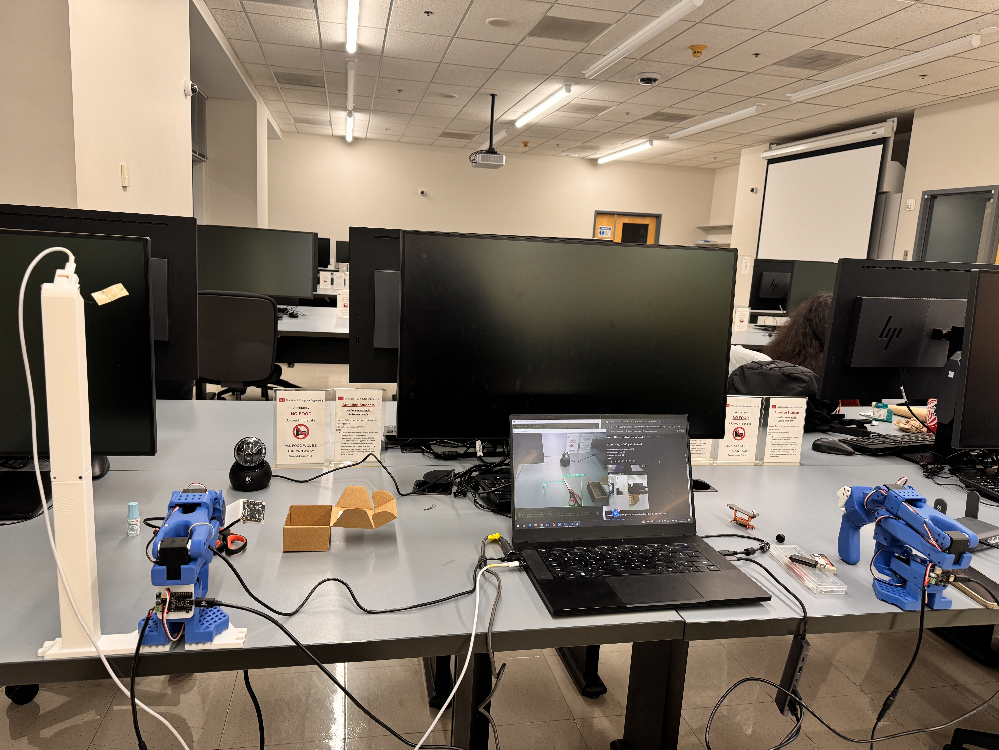
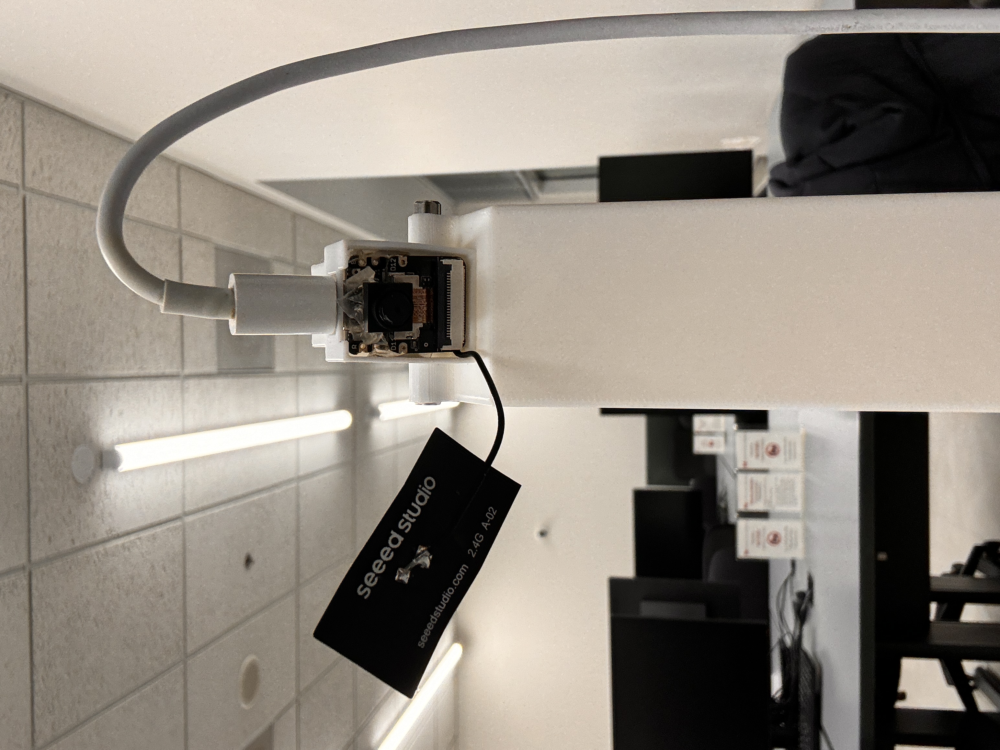
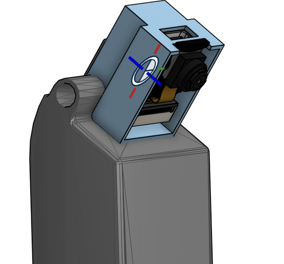
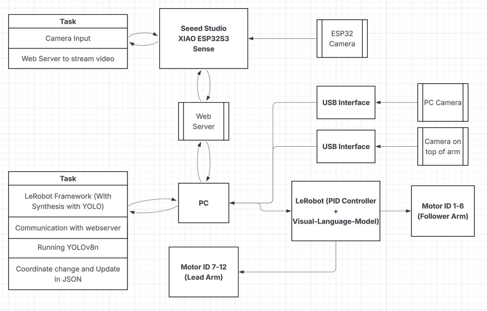

# Augmenting Low-Cost Robotic Arms with YOLO-Based Perception and Vision-Language-Action Policies
## 📖 Introduction

In this project, we build an integrated robotic system that combines vision detection and robotic manipulation using the LeRobot framework.
Our setup includes a XIAO ESP32S3 Sense module for wireless video streaming, a standard laptop webcam, and a UVC arm-mounted camera for multi-view perception.  
We first tested and deployed YOLOv8 models for object detection on the laptop side, leveraging live video feeds streamed over a local Wi-Fi network.  
The robotic manipulation is performed using LeRobot so100 arms, assembled from leader and follower units.  
We trained a Vision-Language-Action (VLA) model and fine-tuned YOLOv8 to operate jointly, enabling the robot to detect, reason, and act in a dynamic environment.  
To further enhance the VLA model’s generalization capability, we designed and implemented our own control strategies based on real-time YOLO detection results.  
The complete technical steps, experimental results, and lessons learned are thoroughly discussed in our final report.  
You can find the video demonstration in the **[Report_VideoDemo Directory](https://github.com/preespp/augment-robot-arm-yolo-vla/tree/main/Report_VideoDemo)** or watch it via our **[YouTube Video Link]()**.

## 📋 Project To-Do List

- Planning to implement YOLOv8 for vision detection and LeRobot so100 robotic arms as the actuators
- Testing YOLOv8 model performance directly on laptop with sample images and webcam video stream
- Deciding between two implementation structures:
  - Running YOLO Nano (tiny model) inference directly on ESP32 (onboard detection)
  - **OR** Streaming video to laptop and running full YOLOv8 detection locally
- Finalizing the choice to use laptop-side YOLOv8 inference based on model size, speed, and ESP32 capabilities
- Understanding and exploring the overall LeRobot framework structure: motor buses, control pipelines, dataset recording, training
- Searching and evaluating possible alternative motors to replace Feetech STS3215 if needed
- Waiting for hardware arrival: receiving and assembling LeRobot leader and follower arms
- Assembling the mechanical structure and wiring motors according to the so100 configuration standard
- Applying the LeRobot framework to:
  - Perform motor calibration for each joint using `control_robot.py calibrate`
  - Execute teleoperation through keyboard control and validate arm movement
  - Record teleoperation datasets using Hugging Face’s dataset standard (LeRobotDataset v2)
  - Visualize dataset frames locally and via `visualize_dataset_html.py`
  - Perform basic policy training (e.g., simple DiffusionPolicy or ACT baseline) using collected data
- Setting up XIAO ESP32S3 Sense board as Wi-Fi camera module for video streaming
- Configuring ESP32-S3 to join existing Wi-Fi network (STA mode), avoiding SoftAP creation
- Debugging MJPEG streaming issues, including partial frames and Wi-Fi packet losses (send error 104)
- Successfully setting up ESP32 camera to stream stable video feed to the laptop
- Using ESP32 camera streaming as the live video source for YOLOv8 running on the laptop
- Preparing dataset from open-source and our own dataset for fine-tuning YOLOv8 model
- Writing timestamp alignment tools to synchronize YOLO detection timestamps with LeRobot dataset frames
- Integrating YOLO bounding box data into LeRobot dataset recording as an additional observation feature
- Recording extended datasets combining robot action data and real-time vision detection results
- Training improved policies (Diffusion / ACT) that utilize both proprioceptive and visual inputs
- Debugging generalization issues by proposing data augmentation strategies or multi-object configurations
- Running trained policies on hardware for evaluation through replay and teleoperation comparison
- Preparing the final demo video showing complete project phases: hardware setup, calibration, teleop, YOLO integration, training, deployment
- Writing and finalizing the technical report including system architecture diagrams, method explanations, experimental results, limitations, and future work discussions

<p align="center">
  
  
  
  
  <p align="center"> Setup + ESP32 Mount + Assembly of Mount in CAD</p>
</p>
<p align="center">
  
  <p align="center">System Architecture Design</p>
</p>

## Project Structure

```graphql
.
├── Images/                               # Photos used in README or reports (e.g., diagrams, sample outputs)
├── LeRobot/                              # LeRobot framework for robotic arm control and data processing
├── Other Scripts/                        # Utility scripts for data preprocessing, testing, and analysis
│   ├── file_manage.py                    # Script for cleaning and managing dataset files
│   ├── label_script.py                   # Script for updating class IDs in YOLO label files
│   ├── main_coord.py                     # Script for testing camera feed, YOLO detection, and center coordinate calculation
│   ├── random_script.py                  # Script for reading class orders from YOLO models (e.g., COCO class list)
│   └── tcp_udp_photo.py                  # Script for testing photo transmission via TCP/UDP protocols
├── PC Scripts/                           # Scripts running on the PC side for processing and control
│   ├── passing_data.py                   # Script for testing data reading from JSON output by YOLO
│   ├── yolo_display_flow.py              # YOLO detection with energy-saving logic (runs YOLO only on motion)
│   ├── yolo_display.py                   # Main script for displaying video feed with YOLO detection and sending data to LeRobot
│   └── yolov8n.pt                        # YOLOv8 Nano model used for inference on the PC side
├── Report_VideoDemo/                     # Directory for formal reports and video demonstrations
├── esp32-HighRes/                        # ESP32-S3 firmware project for camera streaming and YOLO inference
│   ├── main/                             # Main application source code for ESP32 firmware
│   │   ├── CMakeLists.txt                # Build system configuration for compiling main application
│   │   ├── idf_component.yml             # ESP-IDF component metadata (dependencies, versioning)
│   │   └── main.c                        # Core firmware logic: camera initialization, streaming, inference coordination
│   ├── managed_components/espressif__esp32-camera/  # ESP32 camera driver component (library for camera support)
│   ├── CMakeLists.txt                    # Top-level build configuration for the entire firmware project
│   ├── dependencie.lock                  # Dependency lock file ensuring consistent ESP-IDF component versions
│   └── sdkconfig                         # ESP-IDF project configuration (camera settings, Wi-Fi, etc.)
├── fine-tuning/                          # Folder for fine-tuning YOLO models
│   ├── dataset/                          # Dataset directory for fine-tuning
│   │   ├── train/                        # Training dataset (images and labels)
│   │   └── valid/                        # Validation dataset (images and labels)
│   ├── fine-tuning/fine_tuned_yolov5n/   # Output directory for storing fine-tuned YOLOv5n model results
│   ├── runs/                             # YOLO training output (logs, checkpoints, metrics)
│   ├── data.yaml                         # Dataset configuration for YOLO training (paths, class names)
│   ├── fine_tune.py                      # Script to fine-tune YOLO models using Ultralytics API
│   ├── yolo11n.pt                        # Pre-trained YOLOv11 Nano model (optional/custom model)
│   ├── yolov5nu.pt                       # YOLOv5 Nano model (used for fine-tuning)
│   └── yolov8n.pt                        # YOLOv8 Nano model (used for detection/testing)
├── .gitignore                            # Specifies files and directories to be ignored by Git version control
├── LICENSE                               # Licensing information for the project
└── README.md                             # Main project documentation (setup instructions, usage, architecture)
```

## Dependencies Setup

#### 1. Install Ultralytics YOLO for Object Detection (PC Side)

This will automatically install all required dependencies, including `torch`, `numpy`, and others.

```bash
pip install ultralytics
```

#### 2. Install ESP-IDF Framework (ESP32 Firmware Development)

Follow the official ESP-IDF installation guide for your platform:  
[ESP-IDF Installation Guide](https://docs.espressif.com/projects/esp-idf/en/latest/esp32/get-started/)

Alternatively,

```bash
git clone --recursive https://github.com/espressif/esp-idf.git

cd esp-idf

./install.sh
```

#### 3. Install `esp_camera` Module (ESP32-S3 Camera Support)

The `esp_camera` module is included in the ESP-IDF component registry. Ensure it's integrated into your ESP32-S3 project:

```bash
idf.py add-dependency esp32-camera
```

## Running Training & Deployment

#### 1. Configure Wi-Fi and Server IP

- **ESP32 Firmware**: Set your Wi-Fi SSID and password in the firmware source code (e.g., `main.c`).
- **PC Scripts**: Update the `server_ip` variable in `yolo_display.py` to match your ESP32's IP address.

#### 2. Build and Flash ESP32 Firmware

```bash
idf.py set-target esp32s3
idf.py build
idf.py flash monitor
```

#### 3. Run YOLO Object Detection on PC

Start the PC-side YOLO detection and video stream receiver:

```bash
python3 yolo_display.py
```

This script will receive the video stream from the ESP32-S3 and run YOLO inference on each frame.

#### 4. Run LeRobot Framework (for Data Training)

- Follow the LeRobot documentation to set up the environment:  
  [LeRobot GitHub Repository](https://github.com/huggingface/lerobot)
- Use LeRobot to fine-tune or train your data as needed.
- Our Script in LeRobot folder is modified to synthesize with YOLO data passed from yolo_display.py script
- Make sure to run yolo_display.py in the same directory with control_robot from LeRobot

## Link to Demo Video
[Project Demo Video](https://youtu.be/-n9ZhXqO-Go)
## Source
- [Open-Source Dataset1](https://universe.roboflow.com/project-mental-destruction/pencilcase-se7nb/browse?queryText=&pageSize=50&startingIndex=0&browseQuery=true) 
- [Open-Source Dataset2](https://universe.roboflow.com/my-ai-project-cypfp/stationary-nvifk) 
- [Open-Source Dataset3](https://www.kaggle.com/datasets/siddharthkumarsah/plastic-bottles-image-dataset/data)
- [LeRobot](https://github.com/huggingface/lerobot)
- [ESP-IDF](https://docs.espressif.com/projects/esp-idf/en/latest/esp32/get-started/index.html)
- [Ultralytics](https://docs.ultralytics.com/)
